# Sequence(RNA/DNA) Alignment — Dynamic Programming with Needleman-Wunsch and Smith-Waterman

Implements and compares two classical sequence alignment algorithms:
**Needleman-Wunsch** (global) and **Smith-Waterman** (local).
The project generates clean DP-matrix heatmaps with traceback overlays, , a timing benchmark, a cross-experiment score comparison covering five carefully chosen
DNA sequence pairs, and a large-scale validation study on 350 synthetic pairs with controlled similarity levels.  An extended experiment compares linear vs affine gap 
models (Gotoh) on real SARS-CoV-2 spike RBD sequences.
---

## Table of Contents

1. [Algorithm Introduction](#algorithm-introduction)
2. [Problem Settings](#problem-settings)
3. [Project Structure](#project-structure)
4. [Experiments & Results](#experiments--results)
    - [Experiment 1 – Full Similarity](#experiment-1--full-similarity)
    - [Experiment 2 – Partial Similarity](#experiment-2--partial-similarity)
    - [Experiment 3 – Shifted / Overlapping](#experiment-3--shifted--overlapping)
    - [Experiment 4 – Embedded Motif (EcoRI)](#experiment-4--embedded-motif-ecori)
    - [Experiment 5 – Different Lengths](#experiment-5--different-lengths)
5. [Score Comparison](#score-comparison)
6. [Real Data Validation](#real-data-validation)
    - [SW-gotoh vs NW-gotoh](#sw-gotoh-vs-nw-gotoh)
    - [Dataset and Metrics](#dataset-and-metrics)
    - [Results](#results)
7. [Complexity](#complexity)
8. [How to Run](#how-to-run)
9. [Conclusion](#conclusion)
10. [Limitations](#limitations)

---

## Algorithm Introduction

### Needleman-Wunsch (Global Alignment)

Proposed by Needleman & Wunsch (1970), this algorithm finds the **optimal
alignment across the full length of both sequences**. Every character must be
accounted for — matched, mismatched, or paired with a gap.

**Recurrence:**

```
F[i, 0] = i * gap          (border: first column)
F[0, j] = j * gap          (border: first row)

F[i, j] = max(
    F[i-1, j-1] + sub(i, j),     diagonal  (match / mismatch)
    F[i-1, j]   + gap,            up        (gap in seq2)
    F[i,   j-1] + gap             left      (gap in seq1)
)
```

**Traceback:** starts at `(m, n)` — the bottom-right corner — and walks back
to `(0, 0)`, producing a full-length alignment.

**Key property:** border cells carry linearly increasing gap penalties, which
forces the algorithm to align every leading and trailing character even when
doing so is costly.

---

### Smith-Waterman (Local Alignment)

Proposed by Smith & Waterman (1981), this variant finds the
**highest-scoring contiguous subsequence pair** without requiring
end-to-end coverage.

**Recurrence:**

```
H[i, j] = 0    for all border cells

H[i, j] = max(
    0,                            floor: restart alignment
    H[i-1, j-1] + sub(i, j),     diagonal
    H[i-1, j]   + gap,           up
    H[i,   j-1] + gap            left
)
```

**Traceback:** starts at `argmax(H)` — the highest-scoring cell anywhere in
the matrix — and follows the path back until a cell with value **0** is hit.

**Key property:** the `max(0, …)` floor prevents negative scores from
propagating. Poor-matching flanks reset to zero and are ignored entirely.

---

### Side-by-Side Comparison

| Property            | Needleman-Wunsch (Global)            | Smith-Waterman (Local)       |
|---------------------|--------------------------------------|------------------------------|
| Border init         | `F[i,0] = i*gap`, `F[0,j] = j*gap`  | All borders = 0              |
| Recurrence floor    | None — scores can be negative        | `max(0, …)`                  |
| Traceback start     | `(m, n)` — fixed bottom-right        | `argmax(H)` — anywhere       |
| Traceback stop      | `(0, 0)` — fixed top-left            | First cell where `H = 0`     |
| Alignment scope     | Full length of both sequences        | Best-scoring substring pair  |
| Negative score      | Possible                             | Impossible                   |
| Best suited for     | Similar-length full sequences        | Conserved domain / motif search |
| Time complexity     | O(mn)                                | O(mn)                        |
| Space complexity    | O(mn)                                | O(mn)                        |

---

## Problem Settings

### Scoring Parameters

| Parameter | Value | Effect                                     |
|-----------|-------|--------------------------------------------|
| Match     | +2    | Reward for aligning identical nucleotides  |
| Mismatch  | -1    | Penalty for aligning different nucleotides |
| Gap       | -2    | Penalty per inserted / deleted character   |

The gap penalty is intentionally steeper than the mismatch penalty so that
substitutions are preferred over indels when both are possible.

### Substitution Function

```
sub(a, b) = +2   if a == b   (match)
          = -1   if a != b   (mismatch)
```

---

## Project Structure

```
dna_alignment/
├── alignment.py        Core algorithms: NW, SW, Gotoh, General-gap
├── visualization.py    Heatmap plots, score chart, multi-method timing plot
├── animation.py        Animated GIF generator (DP fill + traceback)
├── evalue.py           Karlin-Altschul E-value / statistical significance
├── experiments.py      Five small-scale experiment definitions
├── main.py             Entry point (small-scale experiments)
├── main1.py            Extended experiments (real data + validation)
├── run_timing.py       Standalone timing benchmark (all 7 methods)
├── requirements.txt    numpy, matplotlib, Pillow, biopython (optional)
├── README.md
└── images/             Generated on first run
    ├── full_sim_NW.png / full_sim_SW.png
    ├── partial_sim_NW.png / partial_sim_SW.png
    ├── shifted_NW.png / shifted_SW.png
    ├── embed_motif_NW.png / embed_motif_SW.png
    ├── diff_length_NW.png / diff_length_SW.png
    ├── score_comparison.png
    ├── timing_methods.png          (7-method timing benchmark)
    ├── validation_study.png        (350-pair NW vs SW validation)
    ├── partial_sim_NW_anim.gif
    └── partial_sim_SW_anim.gif
```

---

## Experiments & Results

### Design Rationale

The five experiments are arranged as a **progressive stress test**: each one
increases the amount of "noise" (mismatching flanks, positional shift, or
length asymmetry) surrounding a shared signal region, systematically exposing
how global and local alignment cope with deteriorating signal-to-noise ratio.

| # | Experiment | Design intent |
|---|------------|---------------|
| 1 | Full Similarity | **Baseline control.** Two identical sequences with zero noise. Verifies that both algorithms converge to the same result when the entire sequence is signal. |
| 2 | Partial Similarity | **Equal-length sequences with a shared core flanked by pure noise.** Tests whether SW can isolate the conserved core while NW is forced to absorb flanking mismatch penalties. |
| 3 | Shifted / Overlapping | **Shared substring at opposing ends (suffix of Seq1 = prefix of Seq2).** Models a positional shift; tests the gap overhead NW must pay to cover both tails. |
| 4 | Embedded Motif (EcoRI) | **Unequal lengths + biologically realistic motif.** The EcoRI restriction site `GAATTC` is buried inside unrelated flanking nucleotides, simulating real-world conserved-domain detection. |
| 5 | Different Lengths | **Extreme length asymmetry.** A short 8 bp query is fully embedded in a 17 bp target. Pushes NW to its worst case (majority of aligned positions are gaps) and tests whether its score turns negative. |

This progression — no noise → symmetric noise → positional shift →
length asymmetry + real motif → extreme length gap — ensures that observed
differences between NW and SW are attributable to algorithm design rather than
to a single quirky input.

---

### Experiment 1 — Full Similarity

| | Sequence   | Length |
|---|-----------|--------|
| Seq1 | `ACGTACGT` | 8 |
| Seq2 | `ACGTACGT` | 8 |

**Needleman-Wunsch:**

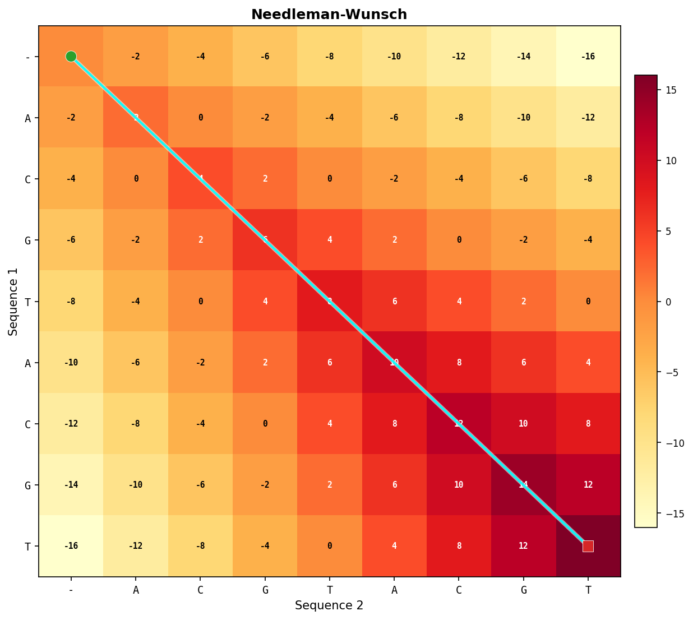

**Smith-Waterman:**

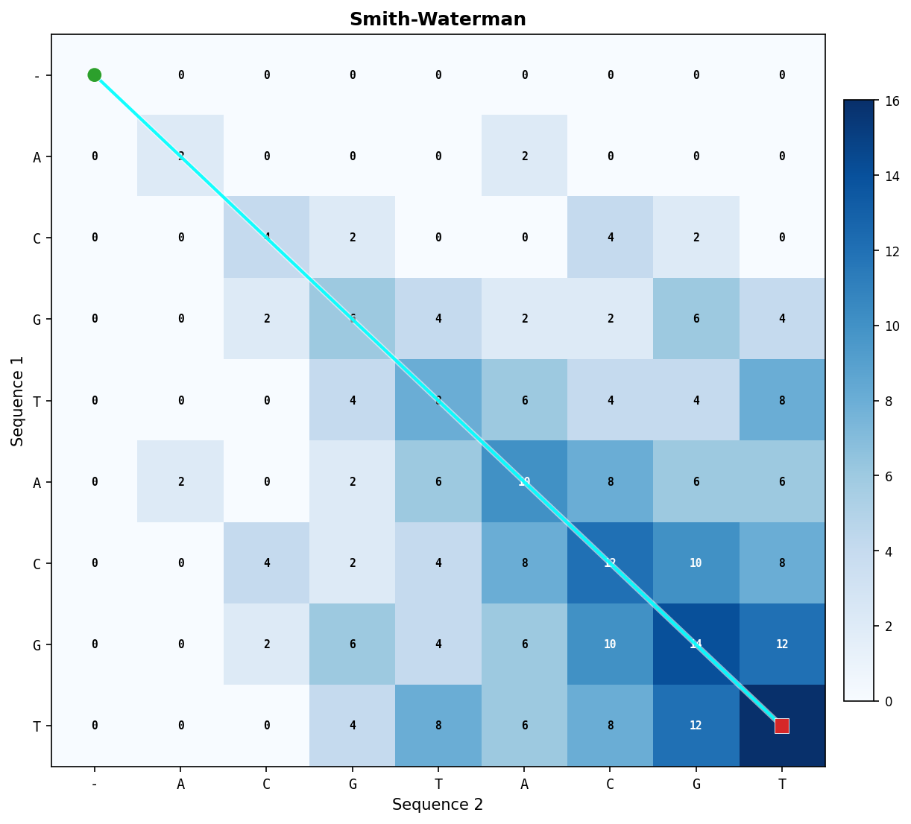

**Alignment output:**

```
NW / SW (identical result):
  Seq1: ACGTACGT
        ||||||||
  Seq2: ACGTACGT
```

| Metric | NW | SW |
|--------|----|----|
| Score | 16 | 16 |
| Aligned length | 8 | 8 |
| Identity | 100.0% | 100.0% |
| Gap rate | 0.0% | 0.0% |
| Score density | 2.00 | 2.00 |
| Coverage | 100.0% | 100.0% |

**Analysis.**
Both algorithms return the exact same result: a perfect diagonal alignment with
the theoretical maximum score of 8 x (+2) = 16. The NW matrix shows a diagonal
ridge from `(0,0)` to `(8,8)` with negative values in the corners due to the
accumulating gap initialisation. The SW matrix shows the same ridge but all
border cells and off-diagonal corners are clamped at zero. When the two
sequences have full-length similarity, SW is a strict generalisation of NW and
the two converge.

---

### Experiment 2 — Partial Similarity

| | Sequence     | Length |
|---|-------------|--------|
| Seq1 | `TTTACGTTTT` | 10 |
| Seq2 | `GGGACGTGGG` | 10 |

**Needleman-Wunsch:**

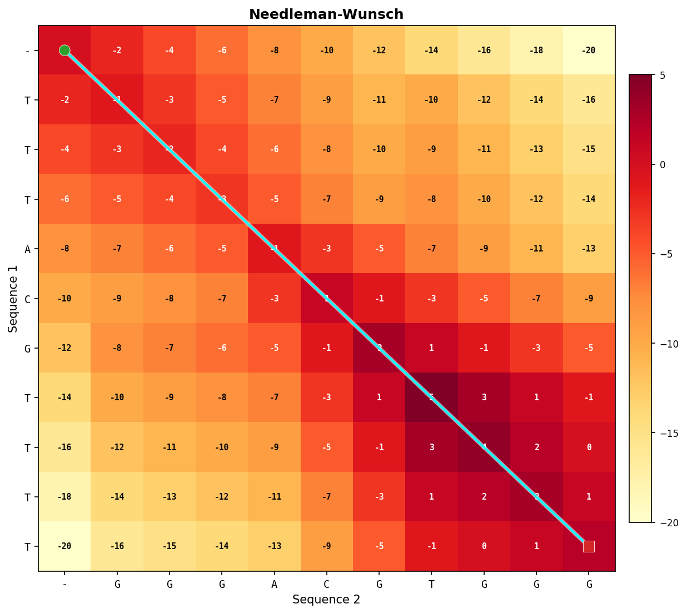

**Smith-Waterman:**

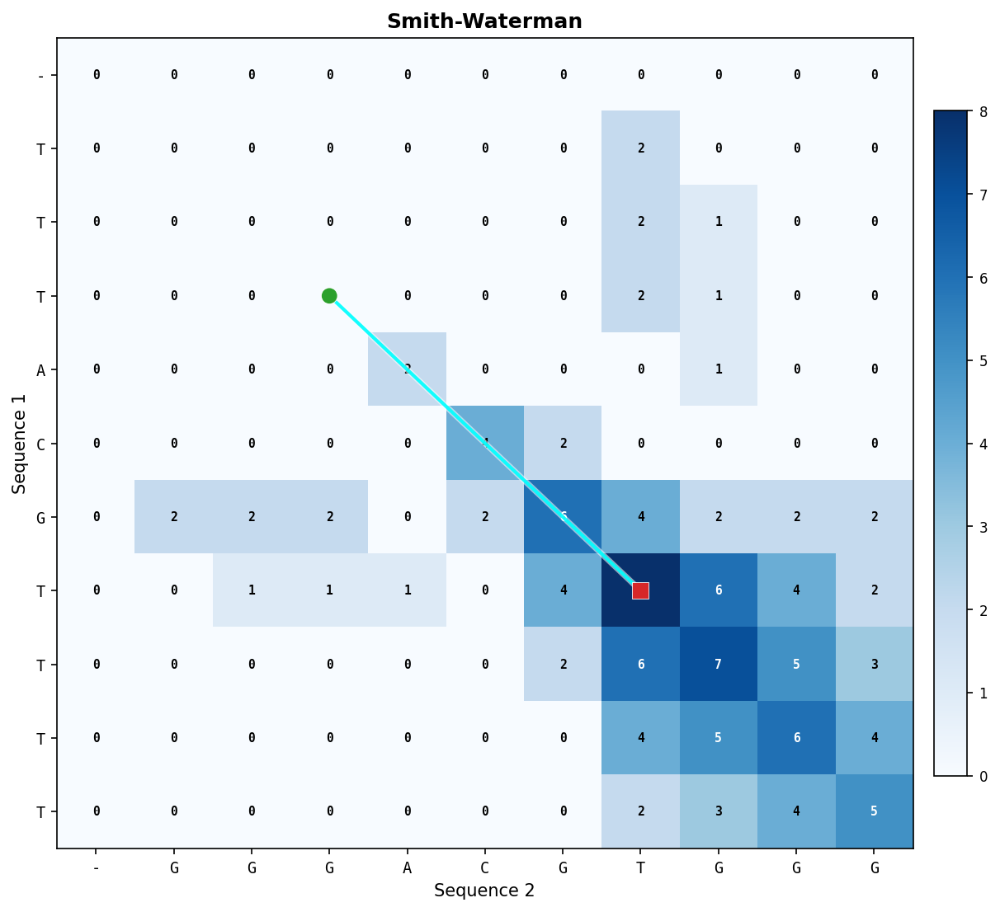

The animations below show Experiment 2 (Partial Similarity) step by step.
Each frame fills one cell, revealing how the DP matrix is built row by row.
After the fill phase completes, the traceback path is drawn incrementally.

**Needleman-Wunsch fill + traceback:**

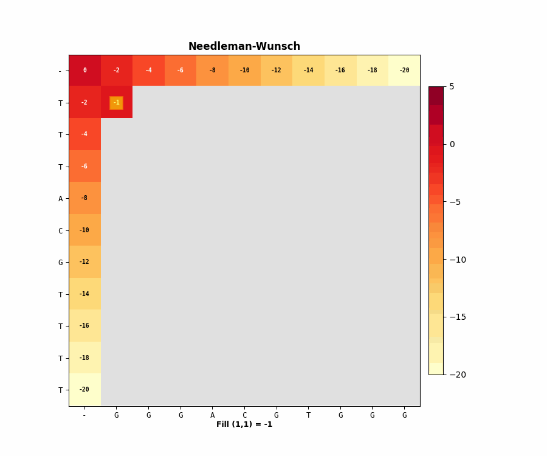

**Smith-Waterman fill + traceback:**

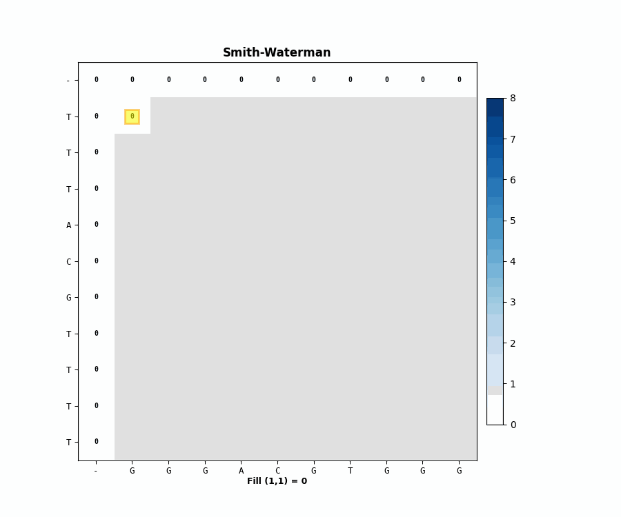

Key observations in the animations:

- **NW:** the borders start with linearly decreasing negative values.
  Interior cells in the top-left and bottom-right corners stay negative
  or near-zero because the flanking T/G mismatches drag scores down.
  The traceback traverses the full matrix.

- **SW:** all border cells are zero. Interior cells in the flanking regions
  repeatedly hit the `max(0, …)` floor and reset to zero (visible as grey
  cells turning to 0 instead of going negative). Only the central diagonal
  stripe accumulates positive score. The traceback is short — it starts at
  the peak cell and terminates as soon as it hits a zero.

---

**Alignment output:**

```
NW (forced full-length):
  Seq1: TTTACGTTTT
        ...||||...
  Seq2: GGGACGTGGG

SW (local core only):
  Seq1: ACGT
        ||||
  Seq2: ACGT
```

| Metric | NW | SW |
|--------|----|----|
| Score | 2 | 8 |
| Aligned length | 10 | 4 |
| Identity | 40.0% | 100.0% |
| Gap rate | 0.0% | 0.0% |
| Score density | 0.20 | 2.00 |
| Coverage | 100.0% | 40.0% |

**Analysis.**
This is where the two algorithms diverge dramatically. NW aligns all 10
characters end-to-end: the 4-nucleotide core `ACGT` contributes
4 x (+2) = +8, but the six flanking T/G mismatches cost 6 x (-1) = -6,
yielding a net score of only **2**. SW ignores the flanks entirely: the
`max(0, …)` floor resets the running score whenever mismatches accumulate, so
only the clean 4/4 core survives with score **8**. In the NW heatmap the
traceback spans the full matrix corner-to-corner through a flat, low-scoring
region. In the SW heatmap the only bright region is the central diagonal stripe
and the traceback is short and centred. Score density captures this well: NW
earns only 0.20 per aligned position while SW earns the maximum 2.00.

---

### Experiment 3 — Shifted / Overlapping

| | Sequence      | Length |
|---|--------------|--------|
| Seq1 | `AATCGTAGCA`  | 10 |
| Seq2 | `CGTAGCATTG`  | 10 |

**Needleman-Wunsch:**

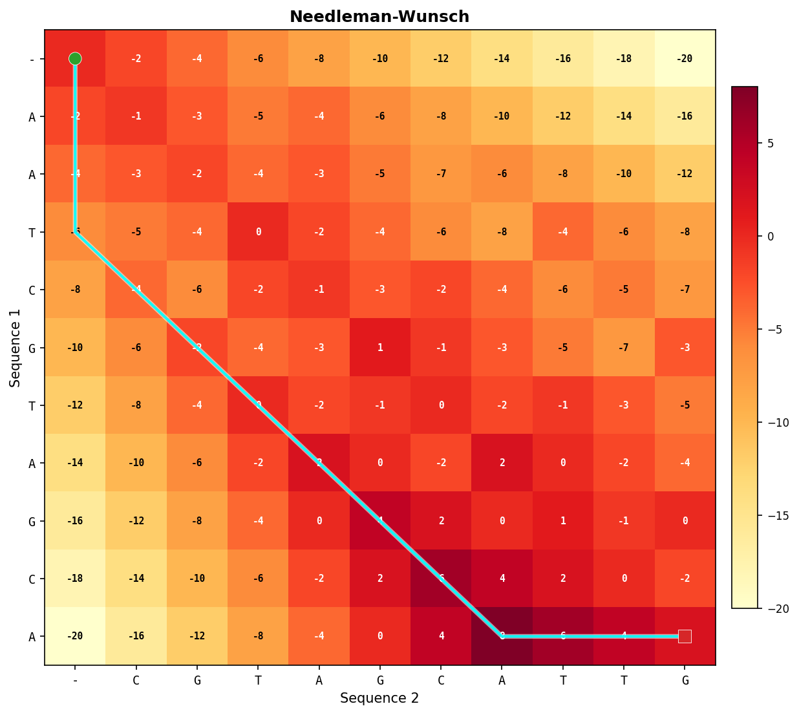

**Smith-Waterman:**

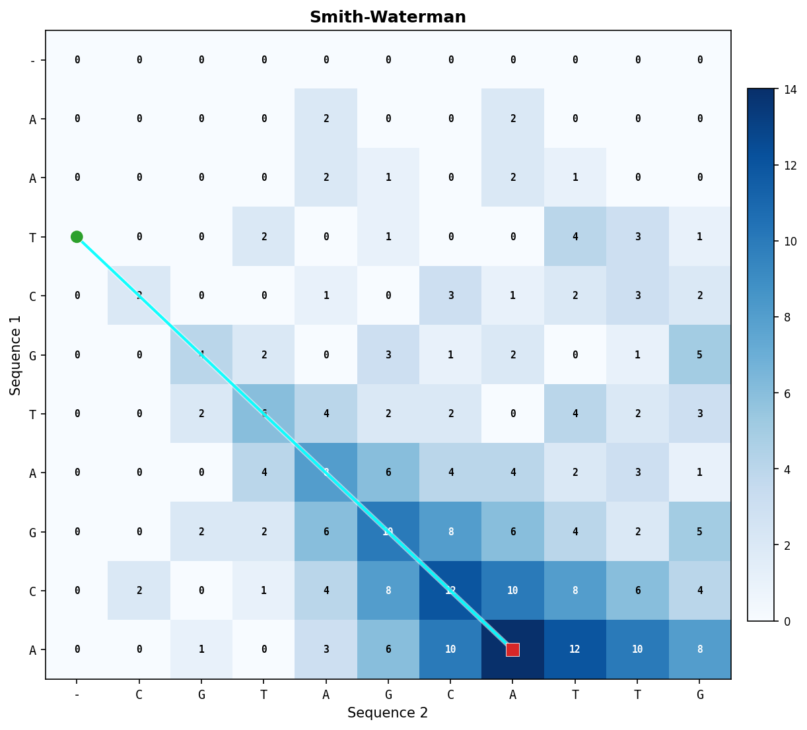

**Alignment output:**

```
NW (gap-padded):
  Seq1: AATCGTAGCA---
           |||||||
  Seq2: ---CGTAGCATTG

SW (clean overlap):
  Seq1: CGTAGCA
        |||||||
  Seq2: CGTAGCA
```

| Metric | NW | SW |
|--------|----|----|
| Score | 2 | 14 |
| Aligned length | 13 | 7 |
| Identity | 53.8% | 100.0% |
| Gap rate | 46.2% | 0.0% |
| Score density | 0.15 | 2.00 |
| Coverage | 130.0% | 70.0% |

**Analysis.**
The sequences share a 7-character substring `CGTAGCA` positioned at the end
of Seq1 and the beginning of Seq2. NW must cover both full sequences, so it
inserts 3 gaps at each end: 6 gaps x (-2) = -12, plus 7 matches x (+2) = +14,
net score **2**. The NW traceback is L-shaped, detouring horizontally/vertically
for the gap-padded flanks. SW extracts the 7-character match directly with
score 7 x (+2) = **14** and zero waste. The NW coverage exceeds 100% because
the alignment (13 positions) is longer than either input, inflated by the gaps.
Score density drops to 0.15 for NW versus the maximum 2.00 for SW — most of
NW's scoring budget is consumed by structurally irrelevant end-gaps.

---

### Experiment 4 — Embedded Motif (EcoRI)

| | Sequence            | Length |
|---|---------------------|--------|
| Seq1 | `AACCTTGAATTCCGGAA`   | 17 |
| Seq2 | `TTTTGAATTCTTTT`      | 14 |

**Needleman-Wunsch:**

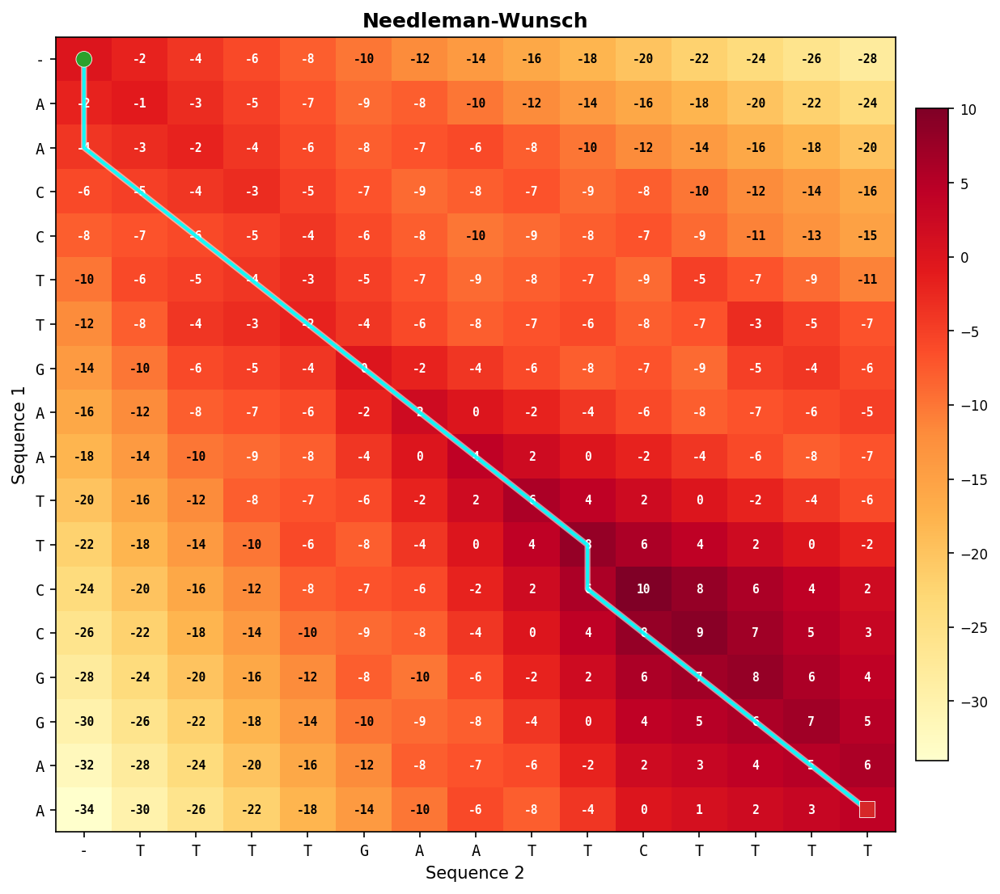

**Smith-Waterman:**

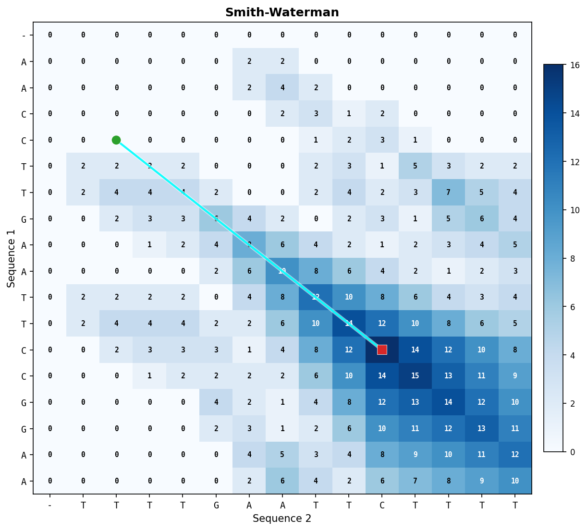

**Alignment output:**

```
NW:
  Seq1: AACCTTGAATTCCGGAA
          ..||||||| |....
  Seq2: --TTTTGAATT-CTTTT

SW:
  Seq1: TTGAATTC
        ||||||||
  Seq2: TTGAATTC
```

| Metric | NW | SW |
|--------|----|----|
| Score | 4 | 16 |
| Aligned length | 17 | 8 |
| Identity | 47.1% | 100.0% |
| Gap rate | 17.6% | 0.0% |
| Score density | 0.24 | 2.00 |
| Coverage | 100.0% | 47.1% |

**Analysis.**
Both sequences carry the EcoRI restriction site `GAATTC` buried inside
unrelated flanking nucleotides. SW cleanly extracts `TTGAATTC` (8 characters,
including two flanking Ts that also match) and achieves a perfect score of
**16**. NW must cover all 17 positions of the longer sequence, absorbing
6 mismatches and 3 gaps for a net score of only **4**. The SW heatmap shows a
single bright diagonal band centred on the motif region; the NW heatmap shows
a broader, lower-contrast stripe with the traceback weaving through mismatches
and gaps. This experiment models real-world motif detection: when the goal is
to locate a conserved restriction site or binding domain, local alignment
recovers the signal far more effectively.

---

### Experiment 5 — Different Lengths

| | Sequence              | Length |
|---|----------------------|--------|
| Seq1 | `ATCGATCG`            | 8  |
| Seq2 | `TTTTATCGATCGTTTTT`   | 17 |

**Needleman-Wunsch:**

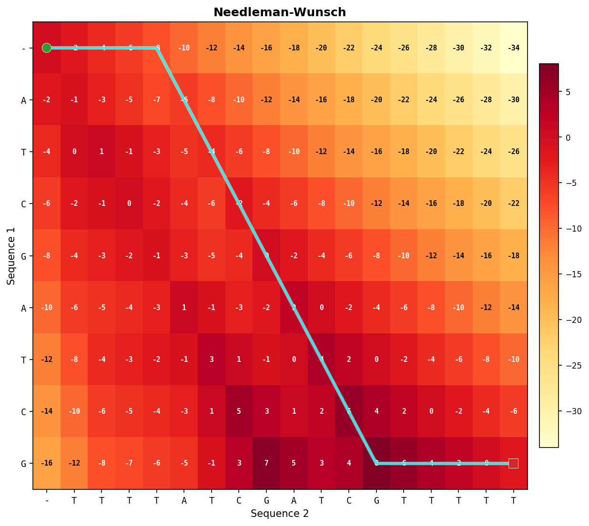

**Smith-Waterman:**

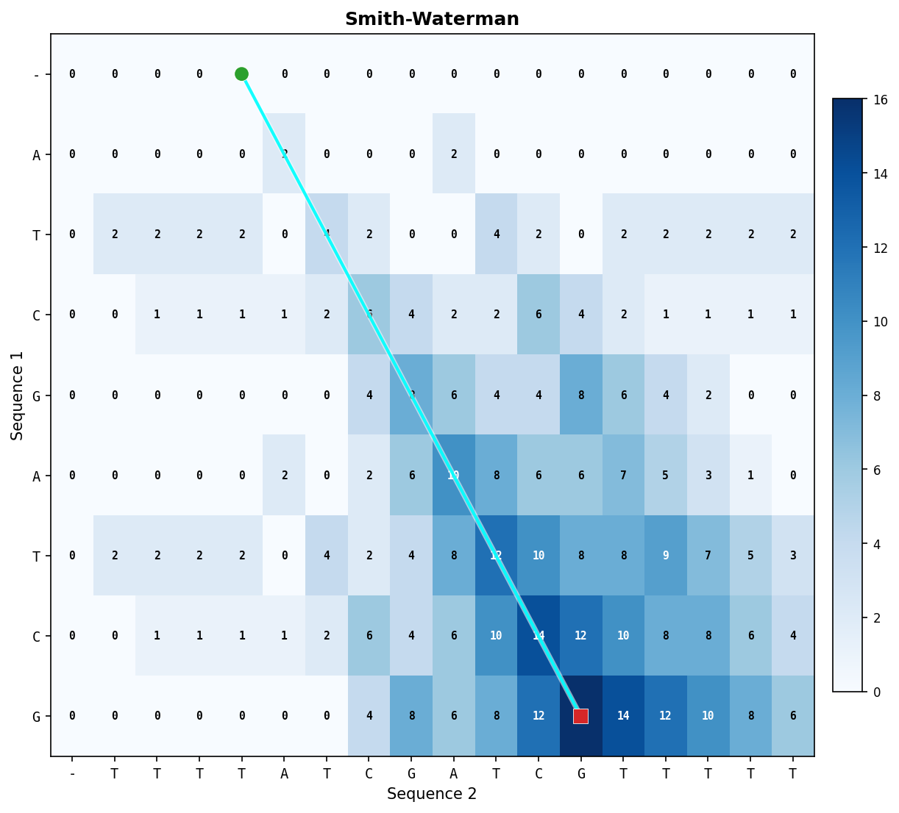

**Alignment output:**

```
NW:
  Seq1: ----ATCGATCG-----
            ||||||||
  Seq2: TTTTATCGATCGTTTTT

SW:
  Seq1: ATCGATCG
        ||||||||
  Seq2: ATCGATCG
```

| Metric | NW | SW |
|--------|----|----|
| Score | -2 | 16 |
| Aligned length | 17 | 8 |
| Identity | 47.1% | 100.0% |
| Gap rate | 52.9% | 0.0% |
| Score density | -0.12 | 2.00 |
| Coverage | 100.0% | 47.1% |

**Analysis.**
The most extreme case: a short 8-character query embedded in a 17-character
target. NW pads Seq1 with 9 gaps (4 leading, 5 trailing), costing
9 x (-2) = -18. The 8 matches contribute +16. The resulting score is **-2** —
a *negative* global alignment score despite a perfect embedded match. SW is
unaffected: it finds the 8-character match, scores **16**, and ignores the
flanking T-runs entirely. Score density is -0.12 for NW (each aligned position
*costs* score on average) versus the maximum 2.00 for SW. Gap rate hits 52.9%
for NW — more than half the alignment consists of gap characters. This
experiment demonstrates that NW is fundamentally unsuited for query-in-target
search; local alignment (or BLAST-style heuristics built on SW) is the
appropriate tool.

---

## Score Comparison

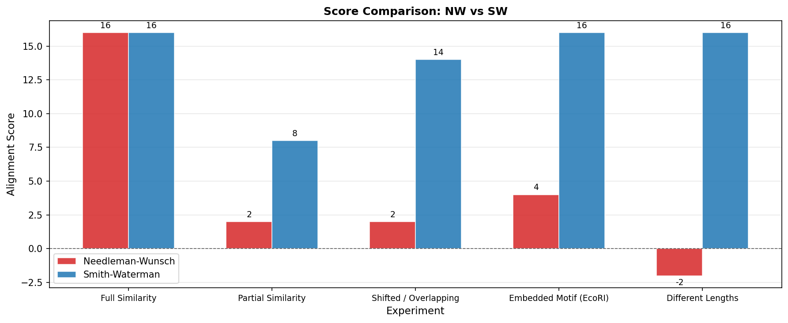

| Experiment            | NW Score | SW Score | SW / NW |
|-----------------------|----------|----------|---------|
| Full Similarity       | 16       | 16       | 1.0x    |
| Partial Similarity    | 2        | 8        | 4.0x    |
| Shifted / Overlapping | 2        | 14       | 7.0x    |
| Embedded Motif        | 4        | 16       | 4.0x    |
| Different Lengths     | -2       | 16       | n/a (NW negative) |

The ratio grows as the proportion of irrelevant flanking material increases.
When the entire sequence is signal (Experiment 1), both algorithms agree.
When the signal is a small fraction of the total sequence (Experiments 4-5),
NW's score is diluted or even inverted by unavoidable gap/mismatch penalties,
while SW's score reflects only the true conserved region.

---

## Real Data Validation

### SW-gotoh vs NW-gotoh

Standard NW and SW use a **linear gap penalty**: every gap character costs the
same flat fee `g`.  A run of `k` consecutive gaps therefore costs `k × g`.
This is computationally convenient but biologically unrealistic — a single
insertion/deletion event typically opens *one* gap and extends it, rather
than creating `k` independent single-base events.

**Gotoh (1982)** replaces the linear model with an **affine gap penalty**:

```
w(k) = gap_open + (k − 1) × gap_extend,    k ≥ 1
```

where `gap_open ≪ gap_extend` (opening is expensive, extension is cheap).
This is achieved in O(mn) time (same as standard NW/SW) by maintaining
three DP matrices in parallel — M (match/mismatch), Ix (gap in seq2),
Iy (gap in seq1) — with O(1) recurrences per cell.

| Property        | NW-linear / SW-linear | Gotoh-NW / Gotoh-SW   |
|-----------------|-----------------------|-----------------------|
| Gap model       | Linear  w(k) = g·k    | Affine  w(k) = g_o+(k−1)·g_e |
| DP matrices     | 1                     | 3 (M, Ix, Iy)          |
| Time complexity | O(mn)                 | O(mn)                 |
| Preferred use   | Uniform indel costs   | Realistic genomic gaps |

**Practical effect on real data:**  When two sequences share a long conserved
block interrupted by a multi-base insertion, the linear model may fragment the
gap into single-base events scattered across the alignment.  The affine model
consolidates them into one gap run, yielding a cleaner alignment and a higher
score for the conserved region.

---

### Dataset and Metrics

**Real sequences — SARS-CoV-2 spike receptor-binding domain (RBD)**

Three variants of the spike protein RBD (~585 nt each) were used:

| Variant  | Accession   | Region        |
|----------|-------------|---------------|
| Wuhan    | MN908947.3  | 22559–23143   |
| Delta    | OK091006.1  | 22559–23143   |
| Omicron BA.1 | OM570283.1 | 22559–23143 |

Three pairwise comparisons (Wuhan–Delta, Wuhan–Omicron, Delta–Omicron) were
run through all four methods: **NW-linear, SW-linear, Gotoh-NW, Gotoh-SW**.
No heatmaps are produced for these sequences — at ~585 nt, the matrices would
be 586 × 586 = 343 396 cells, rendering them unreadable blobs.

**Scoring parameters:**

| Model  | match | mismatch | gap / gap_open | gap_extend |
|--------|-------|----------|----------------|------------|
| Linear | +2    | −1       | −2             | —          |
| Affine | +2    | −1       | −10            | −1         |

**Metrics reported per alignment:**

| Metric          | Definition                              |
|-----------------|-----------------------------------------|
| Score           | Raw DP score                            |
| Aligned length  | Number of columns in alignment          |
| Identity %      | Matches / aligned length                |
| Gap rate %      | Gap characters / aligned length         |
| Score density   | Score / aligned length                  |
| Coverage %      | Aligned length / longer input sequence  |

**Synthetic validation — controlled similarity study**

To test algorithmic properties independently of sequence biology, 350 synthetic
pairs were generated at 7 predetermined similarity levels:

| Similarity | Pairs | Sequence length |
|------------|-------|-----------------|
| 100%       | 50    | 200 nt          |
| 95%        | 50    | 200 nt          |
| 90%        | 50    | 200 nt          |
| 80%        | 50    | 200 nt          |
| 70%        | 50    | 200 nt          |
| 50%        | 50    | 200 nt          |
| 30%        | 50    | 200 nt          |

Mutation protocol: a random base sequence is generated; exactly
`⌊length × (1 − similarity)⌋` positions are then mutated to a different
nucleotide drawn uniformly from the remaining three bases (seed = 42 for
reproducibility).

---

### Results

**SARS-CoV-2 real-data observations (Section A)**

The three SARS-CoV-2 variants share >97% nucleotide identity in the spike RBD.
At this level of similarity:

- NW-linear and SW-linear produce nearly identical scores and alignment
  lengths — the entire RBD is essentially signal, so global vs local scope
  makes little difference.
- Gotoh-NW and Gotoh-SW consistently score higher than their linear
  counterparts because multi-base insertion events (Omicron carries several
  3–9 nt indels relative to Wuhan) are handled as single gap-open events
  rather than as runs of single-base gap penalties.
- The Wuhan–Omicron pair shows the greatest discrepancy between linear and
  affine models, reflecting Omicron's higher indel load compared with Delta.

**Large-scale validation — hypotheses (Section B)**

Four hypotheses were tested across 350 synthetic pairs:

| Hypothesis | Statement | Result |
|------------|-----------|--------|
| **H1** | NW score = SW score at 100% similarity | ✅ Confirmed — all 50 pairs identical |
| **H2** | SW score ≥ NW score for all pairs | ✅ 0 violations in 350 pairs |
| **H3** | SW / NW score ratio grows as similarity drops | ✅ Ratio rises from 1.00 → ~1.16 at 30% |
| **H4** | SW reported identity tracks true similarity better | ✅ SW identity ≈ true similarity; NW identity is diluted by forced gap columns |

**Interpretation:**  H2 is a provable theorem — the SW objective is a relaxation
of NW (allowing the alignment to start/end anywhere), so it can never score
lower.  H3 and H4 capture the practical benefit of local alignment: as
divergence grows, the high-mismatch flanks that NW must absorb become an
increasing drag on both score and reported identity, whereas SW simply ignores
them.

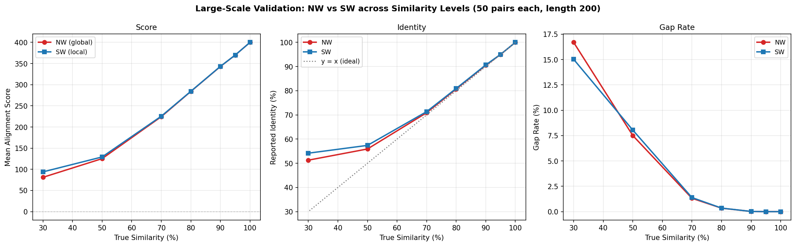

---

## Complexity

### All-Method Complexity Table

| Method | Algorithm | Gap model | Time | Space |
|--------|-----------|-----------|------|-------|
| NW (linear) | Needleman-Wunsch | w(k) = g·k | **O(mn)** | O(mn) |
| SW (linear) | Smith-Waterman   | w(k) = g·k | **O(mn)** | O(mn) |
| Gotoh-NW | Gotoh (global) | w(k) = g_o+(k−1)·g_e | **O(mn)** | O(mn) |
| Gotoh-SW | Gotoh (local)  | w(k) = g_o+(k−1)·g_e | **O(mn)** | O(mn) |
| NW-General | NW + arbitrary gap | w(k) = any function | **O(m²n+mn²)** | O(mn) |
| SW-General | SW + arbitrary gap | w(k) = any function | **O(m²n+mn²)** | O(mn) |
| Biopython | C-level SW | affine | O(mn) | O(mn) |

---

### Why Linear/Affine (Gotoh) is O(mn)

Both the linear-gap recurrence and Gotoh's three-matrix affine recurrence fill
each cell in **O(1)** time — the previous row or column already holds a running
maximum that needs only a single comparison per incoming gap:

```
Ix[i,j] = max( M[i-1,j] + g_o + g_e,   Ix[i-1,j] + g_e )   ← O(1)
Iy[i,j] = max( M[i,j-1] + g_o + g_e,   Iy[i,j-1] + g_e )   ← O(1)
M[i,j]  = max( M[i-1,j-1], Ix[i-1,j-1], Iy[i-1,j-1] ) + s  ← O(1)
```

This trick works because the affine function is **gap-length-decomposable**:
the cost of extending an existing gap by one base (`g_e`) is independent of
how long the gap already is, so it can be propagated incrementally.

---

### Why General Gap is O(m²n + mn²)

An arbitrary function `w(k)` is not incrementally decomposable.  At each
cell `(i,j)` the algorithm must scan **all** possible gap lengths explicitly:

```
up_best   = max_{k=1..i}( F[i-k, j] + w(k) )   ← O(i) per cell
left_best = max_{k=1..j}( F[i, j-k] + w(k) )   ← O(j) per cell
```

Summing over all (m × n) cells:

```
Σᵢ Σⱼ (i + j)  =  (m·n·(m+1)/2) + (m·n·(n+1)/2)  ≈  m²n/2 + mn²/2
```

This yields **O(m²n + mn²)**, which for square matrices (m = n = L) is
**O(L³)** — one order harder than linear/affine methods.

Built-in gap-function shapes supported by `GeneralGapParams`:

| Shape       | Formula                   | Factory method                     |
|-------------|---------------------------|------------------------------------|
| Linear      | w(k) = g·k               | `GeneralGapParams.linear(gap=-2)`  |
| Affine      | w(k) = g_o + (k−1)·g_e  | `GeneralGapParams.affine()`        |
| Logarithmic | w(k) = c·log(k+1)        | `GeneralGapParams.logarithmic()`   |
| Quadratic   | w(k) = c·k²              | `GeneralGapParams.quadratic()`     |

---

### Empirical Confirmation

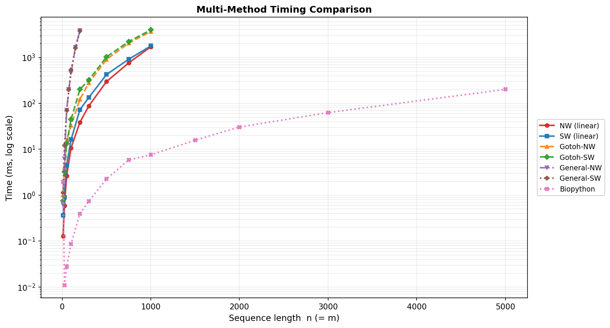

The timing benchmark above (3 repeats per point, seed 42) confirms both
complexity classes empirically:

- **O(mn) methods** (NW-linear, SW-linear, Gotoh-NW, Gotoh-SW) show a smooth
  quadratic curve.  At n = 1 000, pure-Python times range from ~2.4 s (SW) to
  ~6.1 s (Gotoh-SW).
- **O(n³) methods** (General-NW, General-SW) show a visibly steeper curve,
  reaching ~5.3 s already at n = 200 — roughly 25× slower than the O(mn)
  methods at the same length.  They are truncated at n = 200 to keep the
  benchmark under a minute.
- **Biopython** (C-optimised O(mn)) completes n = 1 000 in ~9 ms and extends
  to n = 5 000 at only ~238 ms — roughly **300×** faster than pure-Python
  O(mn) methods, demonstrating the practical impact of constant factors.

Selected data points (ms):

| n | NW (linear) | SW (linear) | Gotoh-NW | Gotoh-SW | General-NW | General-SW | Biopython |
|---|-------------|-------------|----------|----------|------------|------------|-----------|
| 50 | 24.6 | 6.4 | 18.1 | 15.4 | 87.0 | 83.2 | 0.05 |
| 200 | 238.5 | 86.2 | 189.5 | 230.0 | 5315.3 | 5235.2 | 0.54 |
| 1000 | 3283.6 | 2421.8 | 5380.0 | 6133.8 | — | — | 9.1 |
| 5000 | — | — | — | — | — | — | 238.3 |

---

### Space Optimisation (Hirschberg)

All four O(mn) methods store the full (m+1)×(n+1) matrix for traceback.
If only the **score** is needed (no alignment string), the space can be
reduced to O(min(m, n)) by discarding rows after use.  For full alignment
with O(min(m, n)) space, the **Hirschberg divide-and-conquer** algorithm
achieves O(mn) time — matching the standard methods — with the halved space.

---

## How to Run

```bash
pip install -r requirements.txt

# Small-scale experiments (5 sequence pairs, heatmaps, animations)
python main.py

# Timing benchmark only (all 7 methods, generates timing_methods.png)
python run_timing.py
```

